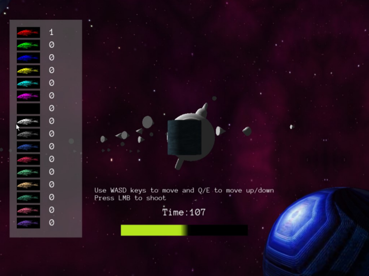

# Advanced-Games-Programming
Physics Simulation networking game created in Urho3D and C++. The game features 'boids' which fly around a 3D environment. Players connect to the server and must shoot the most boids within a given timeframe to win. Optimisation techniques are used to improve the game's frame rate.

Controls:
A-left
D-right
W-forwards
S-backwards
Q-down
E-up
Left Mouse Button - Shoot

Modes:
Single player - Shoot as many boids as possible for high score.
Multiplayer:
	Start server - Host a server on this machine
	Connect - Connect to a server

WARNING: Make sure to end server before disconnecting

Gameplay Screenshot:

Short Video Demonstration:

